<h3><code>marwan@github ~ $ whoami</code></h3>
<table>
  <tr>
    <td valign="top"></td>
    <td valign="top"></td>
  </tr>
</table>

  

  

<h3><code>marwan@github ~ $ ./contributions.sh</code></h3>

---

### 📍 About Me

- 🌍 I'm based in **Giza, Egypt**
- ✉️ You can reach me at [marwan.elzafarani@gmail.com](mailto:marwan.elzafarani@gmail.com)
- 🚀 Currently working on [**DuckyCart**](https://duckycart.me)
- 🕵️ “My code works… I don’t know why, but it works.”

---

### 🛠️ Skills

---

### 🌐 Socials

  <a href="https://www.github.com/Zafaranii" target="_blank" rel="noreferrer">
    <picture>
      <source media="(prefers-color-scheme: dark)" srcset="https://raw.githubusercontent.com/danielcranney/readme-generator/main/public/icons/socials/github-dark.svg" />
      <source media="(prefers-color-scheme: light)" srcset="https://raw.githubusercontent.com/danielcranney/readme-generator/main/public/icons/socials/github.svg" />
      
    </picture>
  </a>
  <a href="https://www.linkedin.com/in/marwan-elzafarani/" target="_blank" rel="noreferrer">
    <picture>
      <source media="(prefers-color-scheme: dark)" srcset="https://raw.githubusercontent.com/danielcranney/readme-generator/main/public/icons/socials/linkedin-dark.svg" />
      <source media="(prefers-color-scheme: light)" srcset="https://raw.githubusercontent.com/danielcranney/readme-generator/main/public/icons/socials/linkedin.svg" />
      
    </picture>
  </a>

---

### 🐍 Snake Contribution Graph

---
